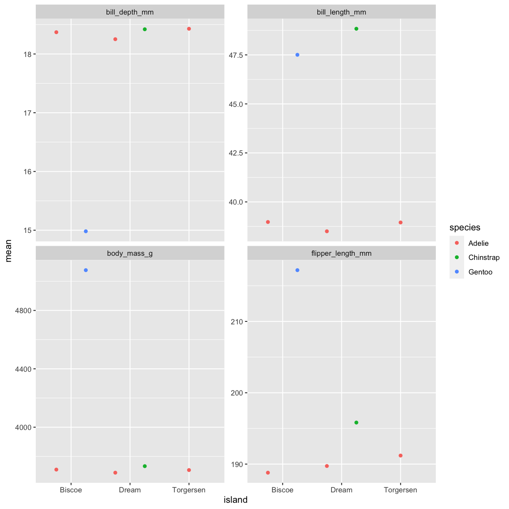
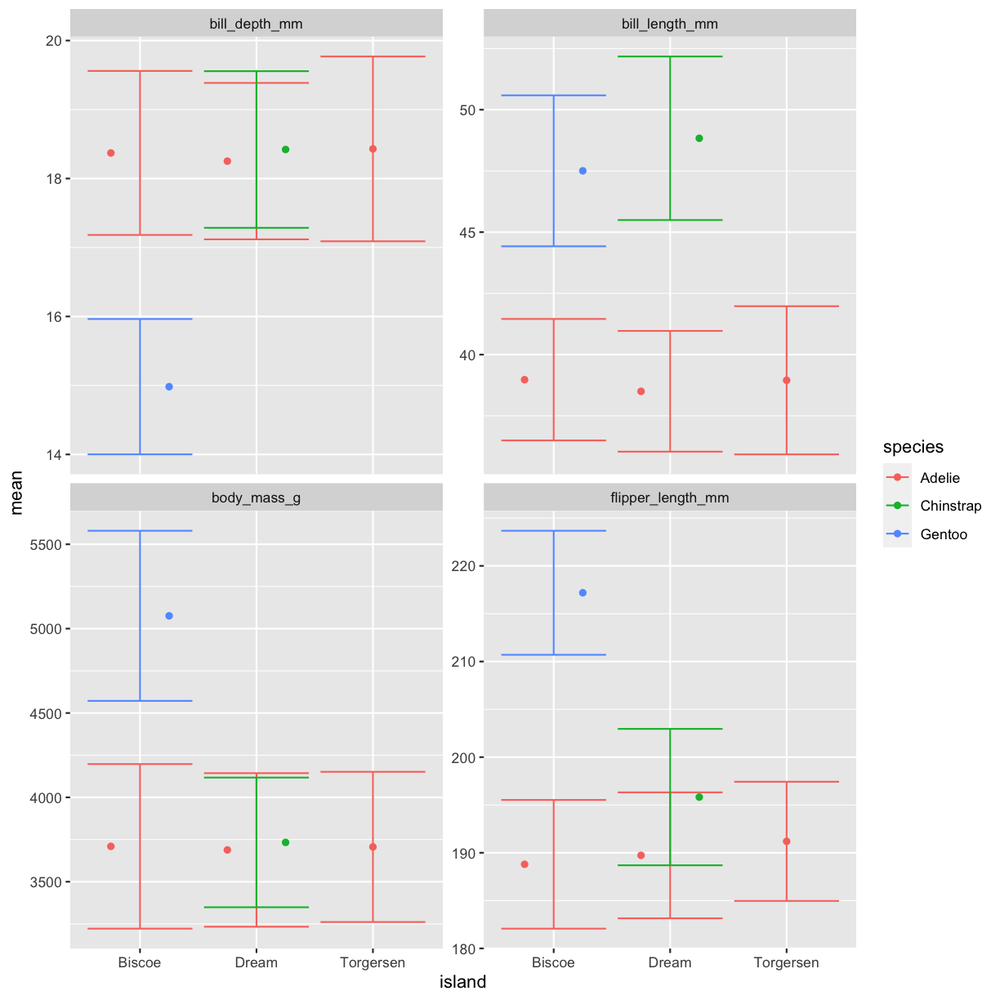
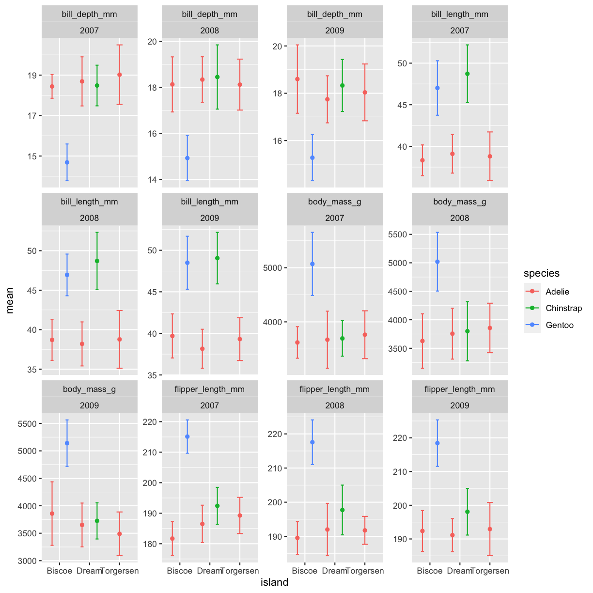

---
# Please do not edit this file directly; it is auto generated.
# Instead, please edit 08-data-complex-pipelines.md in _episodes_rmd/
title: "Complex data pipelines"
teaching: 60
exercises: 7
questions:
- "How can I combine everything I've learned so far?"
- "How can I get my data into a wider format?"
objectives:
- "To be able to combine the different functions we have covered in tandem to create seamless chains of data handling"
- "Creating custom, complex data summaries"
- "Creating complex plots with grids of subplots"
keypoints:
- "Chaining functions together to create larger pipelines"
- "Using facet_grid to greate grids of subplots"
source: Rmd
---

# Motivation
This session is going to be a little different than the others. 
We will be working with more challenges and exploring different way of combining the things we have learned these days.
So we will spend more time in break-out rooms solving challenges and being "hands-on" while in the 
plenary session we will talk about how we solved the challenges and if things are behaving as we expect or not and why.

Before the break, and a little scattered through the sessions, we have been combining the things we have learned. 
It's when we start using the tidyverse as a whole, all functions together that they start really becoming powerful.
In this last session, we will be working on the things we have learned and applying them together in ways that
uncover some of the cool things we can get done.

Lets say we want to summarise _all_ the measurement variables, i.e. all the columns containing "_". 
We've learned about summaries and grouped summaries. 
Can you think of a way we can do that using the things we've learned?

~~~
penguins %>% 
  pivot_longer(contains("_"))
~~~
{: .language-r}

~~~
# A tibble: 1,376 × 6
   species island    sex     year name               value
   <fct>   <fct>     <fct>  <int> <chr>              <dbl>
 1 Adelie  Torgersen male    2007 bill_length_mm      39.1
 2 Adelie  Torgersen male    2007 bill_depth_mm       18.7
 3 Adelie  Torgersen male    2007 flipper_length_mm  181  
 4 Adelie  Torgersen male    2007 body_mass_g       3750  
 5 Adelie  Torgersen female  2007 bill_length_mm      39.5
 6 Adelie  Torgersen female  2007 bill_depth_mm       17.4
 7 Adelie  Torgersen female  2007 flipper_length_mm  186  
 8 Adelie  Torgersen female  2007 body_mass_g       3800  
 9 Adelie  Torgersen female  2007 bill_length_mm      40.3
10 Adelie  Torgersen female  2007 bill_depth_mm       18  
# … with 1,366 more rows
~~~
{: .output}

We've done this before, why is it a clue now? Now that we have learned grouping and summarising, 
what if we now also group by the new name column to get summaries for each column as a row already here!

~~~
penguins %>% 
  pivot_longer(contains("_")) %>% 
  group_by(name) %>% 
  summarise(mean = mean(value, na.rm = TRUE))
~~~
{: .language-r}

~~~
# A tibble: 4 × 2
  name                mean
  <chr>              <dbl>
1 bill_depth_mm       17.2
2 bill_length_mm      43.9
3 body_mass_g       4202. 
4 flipper_length_mm  201. 
~~~
{: .output}
Now we are talking! Now we have the mean of each of our observational columns! Lets add other common summary statistics.

~~~
penguins %>% 
  pivot_longer(contains("_")) %>% 
  group_by(name) %>% 
  summarise(
    mean = mean(value, na.rm = TRUE),
    sd = sd(value, na.rm = TRUE),
    min = min(value, na.rm = TRUE),
    max = max(value, na.rm = TRUE)
  )
~~~
{: .language-r}

~~~
# A tibble: 4 × 5
  name                mean     sd    min    max
  <chr>              <dbl>  <dbl>  <dbl>  <dbl>
1 bill_depth_mm       17.2   1.97   13.1   21.5
2 bill_length_mm      43.9   5.46   32.1   59.6
3 body_mass_g       4202.  802.   2700   6300  
4 flipper_length_mm  201.   14.1   172    231  
~~~
{: .output}

That's a pretty neat table! The repetition of `na.rm = TRUE` in all is a little tedious, though. Let us use an extra argument in the pivot longer to remove `NA`s in the value column

~~~
penguins %>% 
  pivot_longer(contains("_")) %>%
  drop_na(value) %>% 
  group_by(name) %>% 
  summarise(
    mean = mean(value, na.rm = TRUE),
    sd = sd(value, na.rm = TRUE),
    min = min(value, na.rm = TRUE),
    max = max(value, na.rm = TRUE)
  )
~~~
{: .language-r}

~~~
# A tibble: 4 × 5
  name                mean     sd    min    max
  <chr>              <dbl>  <dbl>  <dbl>  <dbl>
1 bill_depth_mm       17.2   1.97   13.1   21.5
2 bill_length_mm      43.9   5.46   32.1   59.6
3 body_mass_g       4202.  802.   2700   6300  
4 flipper_length_mm  201.   14.1   172    231  
~~~
{: .output}

Now we have a pretty decent summary table of our data. 

> ## Challenge 1
> In our code making the summary table. Add another summary column for the number of records, giving it the name `n`.
> _Hint: try the `n()` function._
> > ## Solution
> >
> > 
> > ~~~
> > penguins %>% 
> >   pivot_longer(contains("_")) %>% 
> >   drop_na(value) %>% 
> >   group_by(name) %>% 
> >   summarise(
> >     mean = mean(value),
> >     sd   = sd(value),
> >     min  = min(value),
> >     max  = max(value),
> >     n = n()
> >   )
> > ~~~
> > {: .language-r}
> > 
> > 
> > 
> > ~~~
> > # A tibble: 4 × 6
> >   name                mean     sd    min    max     n
> >   <chr>              <dbl>  <dbl>  <dbl>  <dbl> <int>
> > 1 bill_depth_mm       17.2   1.97   13.1   21.5   342
> > 2 bill_length_mm      43.9   5.46   32.1   59.6   342
> > 3 body_mass_g       4202.  802.   2700   6300     342
> > 4 flipper_length_mm  201.   14.1   172    231     342
> > ~~~
> > {: .output}
> {: .solution}
{: .challenge}

> ## Challenge 2
> Try grouping by more variables, like species and island, is the output what you would expect it to be?
> > ## Solution
> >
> > 
> > ~~~
> > penguins %>% 
> >   pivot_longer(contains("_")) %>% 
> >   drop_na(value) %>% 
> >   group_by(name, species, island) %>% 
> >   summarise(
> >     mean = mean(value),
> >     sd   = sd(value),
> >     min  = min(value),
> >     max  = max(value),
> >     n = n()
> >   )
> > ~~~
> > {: .language-r}
> > 
> > 
> > 
> > ~~~
> > `summarise()` has grouped output by 'name', 'species'. You can override using
> > the `.groups` argument.
> > ~~~
> > {: .output}
> > 
> > 
> > 
> > ~~~
> > # A tibble: 20 × 8
> > # Groups:   name, species [12]
> >    name              species   island      mean      sd    min    max     n
> >    <chr>             <fct>     <fct>      <dbl>   <dbl>  <dbl>  <dbl> <int>
> >  1 bill_depth_mm     Adelie    Biscoe      18.4   1.19    16     21.1    44
> >  2 bill_depth_mm     Adelie    Dream       18.3   1.13    15.5   21.2    56
> >  3 bill_depth_mm     Adelie    Torgersen   18.4   1.34    15.9   21.5    51
> >  4 bill_depth_mm     Chinstrap Dream       18.4   1.14    16.4   20.8    68
> >  5 bill_depth_mm     Gentoo    Biscoe      15.0   0.981   13.1   17.3   123
> >  6 bill_length_mm    Adelie    Biscoe      39.0   2.48    34.5   45.6    44
> >  7 bill_length_mm    Adelie    Dream       38.5   2.47    32.1   44.1    56
> >  8 bill_length_mm    Adelie    Torgersen   39.0   3.03    33.5   46      51
> >  9 bill_length_mm    Chinstrap Dream       48.8   3.34    40.9   58      68
> > 10 bill_length_mm    Gentoo    Biscoe      47.5   3.08    40.9   59.6   123
> > 11 body_mass_g       Adelie    Biscoe    3710.  488.    2850   4775      44
> > 12 body_mass_g       Adelie    Dream     3688.  455.    2900   4650      56
> > 13 body_mass_g       Adelie    Torgersen 3706.  445.    2900   4700      51
> > 14 body_mass_g       Chinstrap Dream     3733.  384.    2700   4800      68
> > 15 body_mass_g       Gentoo    Biscoe    5076.  504.    3950   6300     123
> > 16 flipper_length_mm Adelie    Biscoe     189.    6.73   172    203      44
> > 17 flipper_length_mm Adelie    Dream      190.    6.59   178    208      56
> > 18 flipper_length_mm Adelie    Torgersen  191.    6.23   176    210      51
> > 19 flipper_length_mm Chinstrap Dream      196.    7.13   178    212      68
> > 20 flipper_length_mm Gentoo    Biscoe     217.    6.48   203    231     123
> > ~~~
> > {: .output}
> {: .solution}
{: .challenge}

> ## Challenge 3
> Create another summary table, with the same descriptive statistics (mean, sd ,min,max and n), 
> but for all numerical variables. Grouped only by the variable names.
> > ## Solution
> >
> > 
> > ~~~
> > penguins %>% 
> >   pivot_longer(where(is.numeric)) %>% 
> >   drop_na(value) %>% 
> >   group_by(name) %>% 
> >   summarise(
> >     mean = mean(value),
> >     sd   = sd(value),
> >     min  = min(value),
> >     max  = max(value),
> >     n = n()
> >   )
> > ~~~
> > {: .language-r}
> > 
> > 
> > 
> > ~~~
> > # A tibble: 5 × 6
> >   name                mean      sd    min    max     n
> >   <chr>              <dbl>   <dbl>  <dbl>  <dbl> <int>
> > 1 bill_depth_mm       17.2   1.97    13.1   21.5   342
> > 2 bill_length_mm      43.9   5.46    32.1   59.6   342
> > 3 body_mass_g       4202.  802.    2700   6300     342
> > 4 flipper_length_mm  201.   14.1    172    231     342
> > 5 year              2008.    0.818 2007   2009     344
> > ~~~
> > {: .output}
> {: .solution}
{: .challenge}

## Plotting summaries

Now that we have the summaries, we can use them in plots too! But keep typing or copying the same code over and over is tedious. 
So let us save the summary in its own object, and keep using that.

~~~
penguins_sum <- penguins %>% 
  pivot_longer(contains("_")) %>% 
  drop_na(value) %>% 
  group_by(name, species, island) %>% 
  summarise(
    mean = mean(value),
    sd   = sd(value),
    min  = min(value),
    max  = max(value),
    n = n()
  ) %>% 
  ungroup()
~~~
{: .language-r}

~~~
`summarise()` has grouped output by 'name', 'species'. You can override using
the `.groups` argument.
~~~
{: .output}

We can for instance make a bar chart with the values from the summary statistics.

~~~
penguins_sum %>% 
  ggplot(aes(x = island,
             y = mean,
             fill = species)) +
  geom_bar() +
  facet_wrap(~ name, scales = "free")
~~~
{: .language-r}

~~~
Error in `f()`:
! stat_count() can only have an x or y aesthetic.
~~~
{: .error}

This error message is telling us that we have used an aesthetic that is not needed in geom_bar. 
That is because geom_bar calculates frequencies by calling `stat_count`. 
But we don't want to count, we already have the values we want to plot.
The ggplot geoms that calculates statistics for plots (like geom bar), have a "stat" option.
When we already have calculated the stat, we can let the geom know to use the values as they are by using `stat = "identity"`.

~~~
penguins_sum %>% 
  ggplot(aes(x = island, 
             y = mean,
             fill = species)) +
  geom_bar(stat = "identity") +
  facet_wrap(~ name, scales = "free")
~~~
{: .language-r}

That is starting to look like something nice. But the way the bars for the species are stacking on top of each other is making it a little hard to read. 
In ggplot, there is an argument called "position", that could help us. 
By default in the bar charts position is set to "stacked". 
We should try the "dodge" option.

~~~
penguins_sum %>% 
  ggplot(aes(x = island, 
             y = mean,
             fill = species)) +
  geom_bar(stat = "identity",
           position = "dodge") +
  facet_wrap(~ name, scales = "free")
~~~
{: .language-r}

> ## Challenge 4
> Create a bar chart based om the penguins summary data, where the standard deviations are on the y axis and species are on the x axis. 
> Make sure to dodge the bar for easier comparisons. 
> Create subplots on the different metrics (_Hint: use facet_wrap()_.
> > ## Solution
> >
> > 
> > ~~~
> > penguins_sum %>% 
> >   ggplot(aes(x = island, 
> >              y = sd,
> >              fill = species)) +
> >   geom_bar(stat = "identity",
> >            position = "dodge") +
> >   facet_wrap(~ name)
> > ~~~
> > {: .language-r}
> > 
> > 
> {: .solution}
{: .challenge}

> ## Challenge 5
> Change it so that species is both on the x-axis and the fill for the bar chart, and remove the dodge. 
> What argument do you need to add to `facet_wrap()` to make the y-axis scale vary freely between the subplots? 
> Why is this plot misleading?
> > ## Solution
> >
> > 
> > ~~~
> > penguins_sum %>% 
> >   ggplot(aes(x = species, 
> >              y = sd,
> >              fill = species)) +
> >   geom_bar(stat = "identity",
> >            position = "dodge") +
> >   facet_wrap(~ name, scales = "free")
> > ~~~
> > {: .language-r}
> > 
> > 
> > The last plot is misleading because the data we have summary data by species and island. 
> > Ignoring the island in the plot, means that the values for the different measurements are summed 
> > to create the plot! While it still portrays the data, its ignoring an aspect of the data that 
> > might be significant to take into account. In stead of showing a single standard deviation for, 
> > for instance body mass, would be around 200grams, it looks like now its almost 500grams!
> {: .solution}
{: .challenge}

## Facetting extra long data

But we can get even more creative! 
We mentioned in the pivoting session, that pivoting data is a key skill to really discover how powerful a tool the tidyverse can be.
It's when you start thinking of pivoting as solutions to various tasks that is gets super interesting. 
For instance, in our summary data, we have 4 different statistics, and its hard to get them all nicely into a plot. 
But they all give us some information about the underlying data. 
How can we create a plot that showcases them all?

We can pivot _even longer_ and create subplots for each statistic!

~~~
penguins_sum %>% 
  pivot_longer(c(mean, sd, min, max)))
~~~
{: .language-r}

~~~
Error: <text>:2:38: unexpected ')'
1: penguins_sum %>% 
2:   pivot_longer(c(mean, sd, min, max)))
                                        ^
~~~
{: .error}

What is this error? We already have a column named `name` so when we try to let pivot_longer make another one, we get an error.
 Tibbles will not let you create columns with the same name, thankfully! That would be confusing. 
 Let us make sure the new pivoted column with column names has a distinct name.

~~~
penguins_sum %>% 
  pivot_longer(c(mean, sd, min, max),
               names_to = "stat")
~~~
{: .language-r}

~~~
# A tibble: 80 × 6
   name          species island        n stat  value
   <chr>         <fct>   <fct>     <int> <chr> <dbl>
 1 bill_depth_mm Adelie  Biscoe       44 mean  18.4 
 2 bill_depth_mm Adelie  Biscoe       44 sd     1.19
 3 bill_depth_mm Adelie  Biscoe       44 min   16   
 4 bill_depth_mm Adelie  Biscoe       44 max   21.1 
 5 bill_depth_mm Adelie  Dream        56 mean  18.3 
 6 bill_depth_mm Adelie  Dream        56 sd     1.13
 7 bill_depth_mm Adelie  Dream        56 min   15.5 
 8 bill_depth_mm Adelie  Dream        56 max   21.2 
 9 bill_depth_mm Adelie  Torgersen    51 mean  18.4 
10 bill_depth_mm Adelie  Torgersen    51 sd     1.34
# … with 70 more rows
~~~
{: .output}

Now that we have our extra long data, we can try plotting it all! 
We will switch `facet_wrap()` to `facet_grid()` which creates a grid of subplots. 
The formula for the grid is using both side of the `~` sign. 
And you can think of it like `rows ~ columns`.
So here we are saying we want the `stats` values as rows, and `name` values as columns in the plot grid.

~~~
penguins_sum %>% 
  pivot_longer(c(mean, sd, min, max),
               names_to = "stat") %>% 
  ggplot(aes(x = species, 
             y = value,
             fill = island)) +
  geom_bar(stat = "identity",
           position = "dodge") +
  facet_grid(stat ~ name)
~~~
{: .language-r}

> ## Challenge 6
> It is hard to see the different metrics in the subplots, because they are all on such different scales. 
> Try setting the y-axis to be set freely to allow differences betweem the subplots. 
> Was this the effect you expected?
> > ## Solution
> >
> > 
> > ~~~
> > penguins_sum %>% 
> >   pivot_longer(c(mean, sd, min, max)),
> >                names_to = "stat") %>% 
> >   ggplot(aes(x = species, 
> >              y = value,
> >              fill = island)) +
> >   geom_bar(stat = "identity",
> >            position = "dodge") +
> >   facet_grid(stat ~ name, scales = "free")
> > ~~~
> > {: .language-r}
> > 
> > 
> > 
> > ~~~
> > Error: <text>:2:38: unexpected ','
> > 1: penguins_sum %>% 
> > 2:   pivot_longer(c(mean, sd, min, max)),
> >                                         ^
> > ~~~
> > {: .error}
> {: .solution}
{: .challenge}

> ## Challenge 7
> Try switching up what is plotted as rows and columns in the facet. Does this help the plot?
> > ## Solution
> >
> > 
> > ~~~
> > penguins_sum %>% 
> >   pivot_longer(all_of(c("mean", "sd", "min", "max")),
> >                names_to = "stat") %>% 
> >   ggplot(aes(x = species, 
> >              y = value,
> >              fill = island)) +
> >   geom_bar(stat = "identity",
> >            position = "dodge") +
> >   facet_grid(name ~ stat, scales = "free")
> > ~~~
> > {: .language-r}
> > 
> > 
> > `facet_grid` is more complex than `facet_wrap` as it will always force the y-axis for rows, and x-axis for columns remain the same.
> > So wile setting scales to free will help a little, it will only do so within each row and column, not each subplot. 
> > When the results do not look as you like, swapping what are rows and columns in the grid can often create better results. 
> {: .solution}
{: .challenge}

